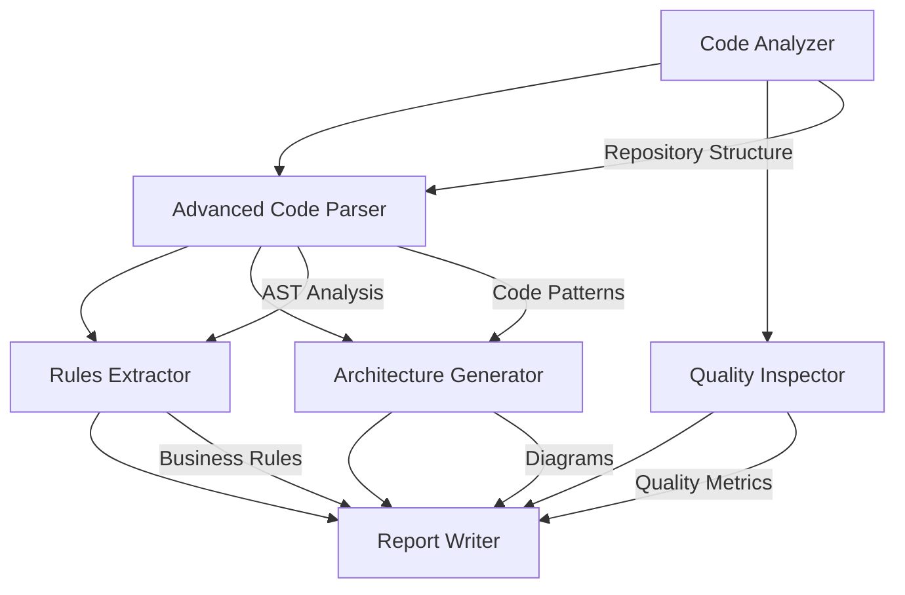

# Advanced Code Analyzer with Architecture & Rules

Comprehensive AI-powered code analysis with architecture diagrams, business rules extraction, and quality assessment.

## Table of Contents
- Overview
- Features
- Architecture
- Installation
- API Keys Setup
- Usage
- Project Structure
- Configuration
- Examples
- Troubleshooting
- Contributing
- License

## Overview
The Advanced Code Analyzer is an AI-powered tool built with the CrewAI framework. It uses multiple specialized AI agents to analyze code structure, extract business rules, generate architecture diagrams, and provide actionable recommendations for code improvement.

## Features

### Core Analysis Capabilities
| Feature | Description | Agent Responsible |
|---------|-------------|------------------|
| Structure Analysis | Maps codebase organization | Code Analyzer |
| Deep Code Parsing | Performs AST analysis, complexity metrics, and pattern detection | Advanced Code Parser |
| Quality Assessment | Identifies code smells, security vulnerabilities, and best practices | Quality Inspector |
| Rules Extraction | Documents business logic, validation rules, and conventions | Rules Extractor |
| Architecture Diagrams | Generates visual system architecture and component maps | Architecture Generator |
| Comprehensive Reports | Produces executive summaries and actionable roadmaps | Report Writer |

### Key Benefits
- AI-Powered Analysis: Leverages GPT-4 for intelligent code understanding.
- Actionable Insights: Prioritized recommendations with implementation timelines.
- Multi-Language Support: Works with Python, JavaScript, Java, Go, and more.
- Visual Documentation: Auto-generated architecture diagrams and flow charts.
- Rapid Assessment: Completes analysis in minutes.
- Professional Reports: Enterprise-ready documentation and executive summaries.

## Architecture

### Agent Workflow


### Multi-Agent System
- **Code Analyzer**: Ingests repository and maps structure.
- **Advanced Code Parser**: Conducts deep AST analysis and complexity assessment.
- **Quality Inspector**: Evaluates security, performance, and best practices.
- **Rules Extractor**: Documents business logic and validation rules.
- **Architecture Generator**: Creates visual system design and component mappings.
- **Report Writer**: Compiles comprehensive reports and recommendations.

## Installation

### Prerequisites
- Python 3.8+
- pip package manager
- Internet connection for AI API calls

### Quick Installation
1. Clone the repository:
   ```bash
   git clone https://github.com/yourusername/advanced-code-analyzer.git
   cd advanced-code-analyzer
   ```
2. Create a virtual environment (recommended):
   ```bash
   python -m venv venv
   source venv/bin/activate  # On Windows: venv\Scripts\activate
   ```
3. Install dependencies:
   ```bash
   pip install -r requirements.txt
   ```
4. Set up environment variables:
   ```bash
   cp .env.example .env
   ```
   Edit `.env` with your API keys (see API Keys Setup).
5. Verify installation:
   ```bash
   python tools.py
   ```

### Dependencies
- crewai>=0.28.8
- crewai-tools>=0.1.6
- python-dotenv>=1.0.0
- openai>=1.0.0
- requests>=2.31.0

## API Keys Setup

### Required API Keys
1. **OpenAI API Key** (Required)
   - Visit: https://platform.openai.com
   - Create an account or log in.
   - Navigate to API Keys and create a new secret key.
   - Copy the key starting with `sk-...`.
   - Cost Estimate: ~$0.50-$2.00 per analysis.
2. **Serper API Key** (Required)
   - Visit: https://serper.dev
   - Sign up with Google/GitHub.
   - Go to Dashboard → API Key and copy your key.
   - Cost: Free tier (2,500 searches/month).

### Environment Configuration
Create a `.env` file in the project root:
```plaintext
# OpenAI Configuration
OPENAI_API_KEY=sk-your-openai-key-here
OPENAI_MODEL_NAME=gpt-4o-mini

# Serper Configuration
SERPER_API_KEY=your-serper-key-here

# Optional Settings
OPENAI_TIMEOUT=120
MAX_ITERATIONS=5
VERBOSE=true
```

### Test Your Setup
```bash
python test_keys.py
```
Expected output:
```
OpenAI key works!
Serper key works!
```

## Usage

### Basic Usage
```bash
python main.py
```
Follow prompts:
- Repository URL: https://github.com/user/repo
- Programming Language: Python
- Project Name: My Analysis

### Programmatic Usage
```python
from crew import CodeAnalyzerCrew

# Initialize crew
crew = CodeAnalyzerCrew()

# Run analysis
result = crew.run({
    'repository_path': 'https://github.com/user/repo',
    'programming_language': 'Python',
    'project_name': 'My Project Analysis'
})

print(result)
```

## Project Structure
```
advanced-code-analyzer/
├── README.md                 # This file
├── main.py                   # Application entry point
├── agents.py                 # AI agent definitions
├── tasks.py                  # Task configurations
├── tools.py                  # Tool management
├── crew.py                   # Crew orchestration
├── test_keys.py              # API key validation
├── requirements.txt          # Python dependencies
├── .env.example              # Environment template
├── .gitignore                # Git ignore rules
├── outputs/                  # Generated reports
│   └── reports/              # Analysis results
├── docs/                     # Documentation
│   ├── examples/             # Usage examples
│   └── screenshots/          # UI screenshots
└── tests/                    # Unit tests
    ├── test_agents.py
    ├── test_tasks.py
    └── test_integration.py
```

### Key Files
| File | Purpose | Description |
|------|---------|-------------|
| main.py | Entry Point | Interactive CLI application |
| agents.py | AI Agents | Six specialized analysis agents |
| tasks.py | Workflows | Task definitions and dependencies |
| tools.py | Integrations | API tools and configurations |
| crew.py | Orchestration | Crew management and execution |

## Configuration

### Environment Variables
| Variable | Required | Default | Description |
|----------|----------|---------|-------------|
| OPENAI_API_KEY | Yes | - | OpenAI API authentication |
| SERPER_API_KEY | Yes | - | Serper search API key |
| OPENAI_MODEL_NAME | No | gpt-4o-mini | AI model selection |
| OPENAI_TIMEOUT | No | 60 | API timeout (seconds) |
| MAX_ITERATIONS | No | 3 | Max agent iterations |
| VERBOSE | No | true | Detailed logging |

### Model Selection
```plaintext
# Cost-optimized (recommended)
OPENAI_MODEL_NAME=gpt-4o-mini

# Higher quality (more expensive)
OPENAI_MODEL_NAME=gpt-4o

# Alternative models
OPENAI_MODEL_NAME=gpt-3.5-turbo
```

### Output Customization
In `crew.py`:
```python
OUTPUT_FORMAT = "markdown"  # markdown, json, html
INCLUDE_DIAGRAMS = True
DETAILED_METRICS = True
EXECUTIVE_SUMMARY = True
```

## Examples

### Example 1: Analyzing a Python Web Application
**Input:**
- Repository: https://github.com/fastapi/fastapi
- Language: Python
- Project: FastAPI Framework Analysis

**Output Highlights:**
- 847 Python files analyzed
- 23 design patterns identified
- 156 API endpoints documented
- 12 security recommendations
- Architecture diagrams generated
- Technical debt: 2.3 days

### Example 2: JavaScript React Application
**Input:**
- Repository: https://github.com/facebook/react
- Language: JavaScript
- Project: React Library Analysis

**Key Findings:**
- Code Quality Score: 8.7/10
- Component Architecture: Well-structured
- Security Issues: 3 minor findings
- Performance: Highly optimized
- Maintainability Index: 85/100

### Sample Output Structure
#### Project Analysis Report

##### Executive Summary
- **Overall Health**: Excellent (8.5/10)
- **Critical Issues**: 2 security vulnerabilities
- **Improvement Potential**: 15% performance gain
- **Technical Debt**: 3.2 days

##### Architecture Overview
[Generated Architecture Diagram]

##### Detailed Findings
###### Code Quality (Score: 8.5/10)
- Consistent naming conventions
- Missing error handling in auth module
- Complex functions detected (3 instances)

###### Security Assessment
- SQL injection vulnerability (high priority)
- Unvalidated input in user module (medium)
- Authentication properly implemented

##### Recommendations
1. **Immediate** (Within 1 week)
   - Fix SQL injection in user.py:142
   - Add input validation
2. **Short-term** (Within 1 month)
   - Refactor complex functions
   - Add unit tests (coverage: 67% → 85%)
3. **Long-term** (Within 3 months)
   - Implement caching strategy
   - Consider microservices architecture

## Troubleshooting

### Common Issues
1. **API Key Errors**
   - **Problem**: "Invalid API key"
   - **Solution**:
     1. Verify keys in `.env` file.
     2. Check for extra spaces/characters.
     3. Regenerate keys if needed.
     ```bash
     python test_keys.py
     ```
2. **Network Timeouts**
   - **Problem**: "Request timeout"
   - **Solution**: Increase timeout
     ```plaintext
     OPENAI_TIMEOUT=180  # 3 minutes
     ```
3. **Repository Access**
   - **Problem**: "Cannot access repository"
   - **Solutions**:
     1. Ensure repository is public.
     2. Check URL format: https://github.com/user/repo
     3. Try with raw GitHub URLs.
4. **Memory Issues**
   - **Problem**: "Out of memory"
   - **Solutions**:
     1. Analyze smaller repositories first.
     2. Use pagination for large codebases.
     3. Increase system memory allocation.

### Debug Mode
```bash
export VERBOSE=true
python main.py
```
Check tool validation:
```bash
python tools.py
```
Run individual components:
```bash
python -c "from agents import create_agents; print('Agents OK')"
```

### Performance Optimization
```plaintext
# Use faster model for development
OPENAI_MODEL_NAME=gpt-3.5-turbo

# Reduce iterations for quick testing
MAX_ITERATIONS=1

# Limit analysis scope
ANALYZE_TESTS=false
INCLUDE_DOCS=false
```

## Contributing
We welcome contributions! Please see our Contributing Guidelines.

### Development Setup
1. Fork the repository:
   ```bash
   git clone https://github.com/yourusername/advanced-code-analyzer.git
   ```
2. Create a feature branch:
   ```bash
   git checkout -b feature/amazing-feature
   ```
3. Set up development environment:
   ```bash
   pip install -r requirements-dev.txt
   pre-commit install
   ```
4. Run tests:
   ```bash
   python -m pytest tests/ -v
   ```
5. Make changes and commit:
   ```bash
   git commit -m "Add amazing feature"
   git push origin feature/amazing-feature
   ```
6. Create a Pull Request.

### Code Style
```bash
# Format code
black .
isort .

# Lint code
flake8 .
mypy .

# Run all checks
make lint
```

### Adding New Features
- **New Agent**: Add to `agents.py` with proper tools.
- **New Task**: Define in `tasks.py` with context dependencies.
- **New Tool**: Configure in `tools.py` with validation.
- **Tests**: Add comprehensive test coverage.

## License
[Specify license details here]