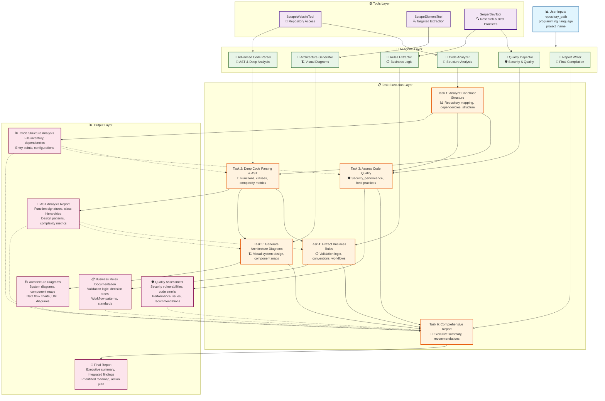
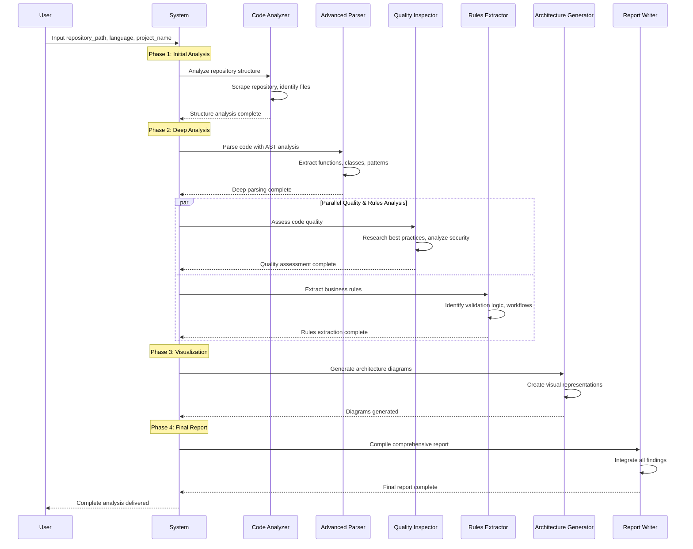
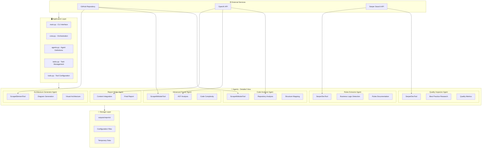

# Architecture diagrams

### Full System Architecture



### 📊 Detailed Sequential Flow Diagram



### 🔄 Data Flow Architecture

```mermaid
graph LR
    subgraph INPUT_DATA [📥 Input Data]
        I1[Repository URL]
        I2[Programming Language]
        I3[Project Name]
    end
    
    subgraph PROCESSING_PIPELINE [🔄 Processing Pipeline]
        
        subgraph STAGE1 [Stage 1: Ingestion]
            P1[Repository Scraping]
            P2[File Classification]
            P3[Dependency Mapping]
        end
        
        subgraph STAGE2 [Stage 2: Analysis]
            P4[AST Parsing]
            P5[Pattern Recognition]
            P6[Complexity Analysis]
            P7[Quality Metrics]
            P8[Security Scanning]
        end
        
        subgraph STAGE3 [Stage 3: Extraction]
            P9[Business Rules]
            P10[Validation Logic]
            P11[Configuration Rules]
            P12[Workflow Patterns]
        end
        
        subgraph STAGE4 [Stage 4: Visualization]
            P13[System Architecture]
            P14[Component Diagrams]
            P15[Data Flow Charts]
            P16[UML Diagrams]
        end
        
        subgraph STAGE5 [Stage 5: Reporting]
            P17[Data Integration]
            P18[Report Generation]
            P19[Recommendation Engine]
        end
    end
    
    subgraph OUTPUT_DATA [📤 Output Data]
        O1[Structure Report]
        O2[Quality Assessment]
        O3[Architecture Diagrams]
        O4[Business Rules Doc]
        O5[Final Report]
    end
    
    INPUT_DATA --> STAGE1
    STAGE1 --> STAGE2
    STAGE2 --> STAGE3
    STAGE2 --> STAGE4
    STAGE3 --> STAGE5
    STAGE4 --> STAGE5
    STAGE5 --> OUTPUT_DATA
```


### 🏛️ System Architecture - Component View


### 📈 Performance & Scaling Architecture
```mermaid
graph TB
    subgraph PERFORMANCE [⚡ Performance Considerations]
        PERF1[Parallel Agent Execution<br/>Quality Inspector || Rules Extractor]
        PERF2[Caching Layer<br/>Repository data, API responses]
        PERF3[Rate Limiting<br/>API call management]
        PERF4[Memory Management<br/>Large repository handling]
    end
    
    subgraph SCALING [📈 Scaling Options]
        SCALE1[Batch Processing<br/>Multiple repositories]
        SCALE2[Distributed Agents<br/>Cloud deployment]
        SCALE3[Database Integration<br/>Result persistence]
        SCALE4[Web Interface<br/>Multi-user access]
    end
    
    subgraph MONITORING [📊 Monitoring & Observability]
        MON1[Execution Metrics<br/>Time, cost, success rate]
        MON2[Quality Metrics<br/>Analysis accuracy, completeness]
        MON3[Error Tracking<br/>Failures, retries, recovery]
        MON4[Usage Analytics<br/>Popular features, patterns]
    end
```
